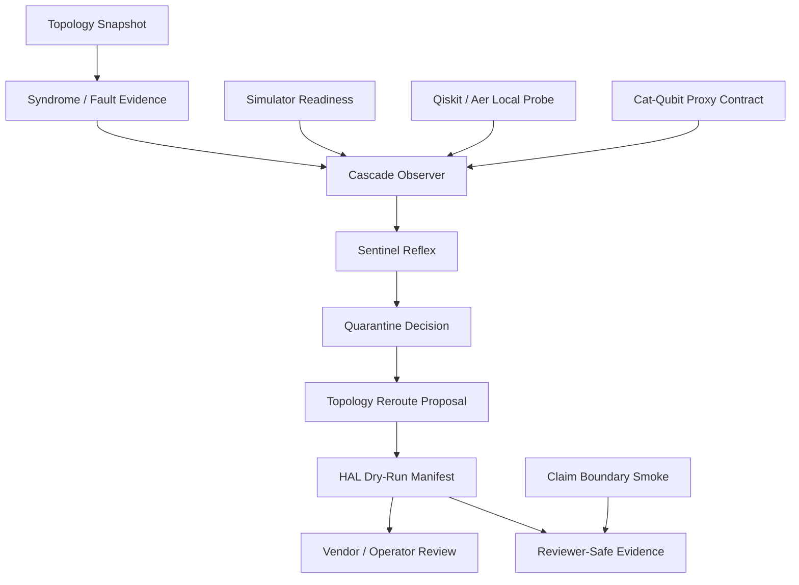

# HQA V2 Reviewer Brief

## One-Line Summary

HQA V2 is a claim-bounded quantum-control proxy lab for testing local fault response, cascade observation, quarantine/reroute proposals, and shadow-mode vendor handoff contracts.

## What It Is

HQA V2 is a modular control-plane prototype.

It focuses on a narrow question:

> Can a local advisory layer notice instability early, preserve the evidence trail, propose bounded quarantine/reroute actions, and keep hardware authority outside the model?

Current HQA V2 work is organized around five lanes:

1. Safe proxy demos
2. Local simulator/cascade evidence
3. Cat-qubit solver contract
4. Vendor shadow-mode schemas
5. Claim-boundary and packet validation

## What It Is Not

HQA V2 is not:

- a live quantum hardware controller
- a production QEC system
- physical quantum hardware validation
- a claim of quantum advantage
- an autonomous cryostat or backend controller

The current implementation is intentionally conservative. It is designed to be evaluated before it is trusted.

## Architecture



## Current Evidence Snapshot

| Area | Current State |
|---|---|
| Regression suite | `22/22` passing |
| Claim-boundary smoke | Passing |
| Local Qiskit/Aer lane | Available |
| Local Cirq/qsim lane | Available |
| IBM Runtime lane | Prepared, not active in this environment |
| QuTiP/Dynamiqs/JAX cat lane | Spec-only until installed |
| CUDA-Q lane | Parked due to local CUDA/toolchain mismatch |
| Vendor packet | Generated and schema-validated |

## Key Artifacts

| Artifact | Why It Matters |
|---|---|
| `hqa_v2/docs/HQA_TECHNICAL_INDEX.md` | Navigation map for technical review. |
| `hqa_v2/reports/HQA_V2_REGRESSION_SUMMARY.md` | One-command regression evidence. |
| `hqa_v2/reports/HQA_QISKIT_AER_CASCADE_GATE.md` | Shows nominal/stress cascade profile separation. |
| `hqa_v2/reports/HQA_CAT_CASCADE_PROXY.md` | Defines the cat-qubit physics lane without pretending unavailable solvers ran. |
| `hqa_v2/docs/HQA_VENDOR_INTERFACE_CONTRACT.md` | Defines vendor-neutral handoff schemas. |
| `hqa_v2/reports/HQA_VENDOR_SHADOW_PACKET_VALIDATION.md` | Validates the sample shadow packet against local contracts. |
| `hqa_v2/docs/HQA_CHAOS_WORLD_MODEL_TRANSFER_MEMO.md` | Explains safe concept transfer from chaos-worldmodel theory into HQA-native risk fields. |

## Handoff Shape

HQA expects a lab or simulator to provide:

- topology snapshot
- syndrome records
- optional coherence/error metadata
- optional backend constraints

HQA returns:

- quarantine decision
- reroute proposal
- HAL dry-run manifest
- audit trail

The vendor or operator remains responsible for any physical execution.

## One-Command Verification

From the repository root:

```powershell
python hqa_v2/quality/hqa_v2_regression_runner.py
python hqa_v2/quality/claim_boundary_smoke_test.py
```

## Evaluation Posture

The correct way to evaluate HQA V2 is as a shadow-advisory architecture:

1. Run local regression.
2. Review simulator/cascade evidence.
3. Inspect schemas.
4. Validate the sample shadow packet.
5. If interested, provide a read-only topology/syndrome fixture.
6. Compare HQA proposals against the lab's existing control policy.

## North Star

The goal is not to make HQA louder.

The goal is to make each boundary visible, each output replayable, and each proposed action constrained until a real technical team grants a narrower evaluation path.
